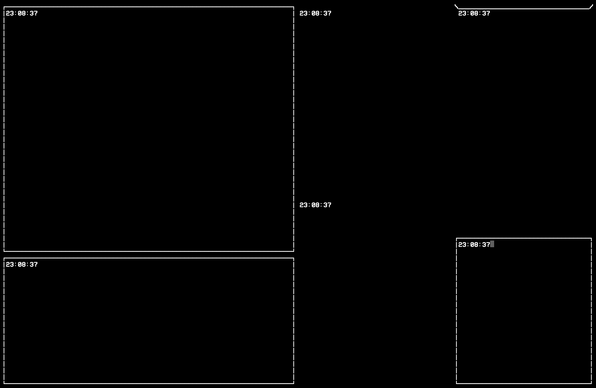

# terminal-ui

The `terminalui` package is designed to simplify output to a terminal window by allowing the specification of panes with static or dynamic content. These panes, defined by either vertical or horizontal splits, structure the terminal window. The main pane, which represents the entire terminal window, can be split into additional panes, which in turn can be further subdivided, much like the functionality found in the popular tool, tmux.

Pane sizes can be specified either as a percentage or by a fixed number of characters. The content within a pane can be dynamic, sourced from an attached function (referred to as a Widget in the example code below).

Panes can also feature borders, which are customisable by defining the characters to be used for each side (e.g., left edge, top-left corner, top bar, etc.).

The package utilises ANSI escape codes and has been tested on macOS and Linux.

### Install

Ensure you have your
[workspace directory](https://golang.org/doc/code.html#Workspaces) created and
run the following:

```
go get -u github.com/mikolajgs/terminal-ui
```

### Example

See below sample code and a screenshot of its execution.

```
package main

import (
    "os"
    tui "github.com/mikolajgs/terminal-ui"
)

// TUI has onDraw event and a function can be attached to it. onDraw is
// called when TUI is being drawn, eg. when first started or when
// terminal window is resized.
// getOnTUIDraw returns a func that will later be attached in main().
func getOnTUIDraw() func(*tui.TUI) int {
    // It does nothing actually.
    fn := func(c *tui.TUI) int {
        return 0
    }
    return fn
}

// TUIPane has onDraw event and a function can be attached to it. onDraw
// is called when TUI is being drawn, eg. when first started or when
// terminal window is resized.
// getOnTUIPaneDraw returns a func that will later be attached in main().
func getOnTUIPaneDraw(p *tui.TUIPane) func(*tui.TUIPane) int {
    // Func is defined separate in another struct which is called a Widget.
    // This Widget prints out current time. Check the source for more.
    t := tui.NewTUIWidgetSample()
    t.InitPane(p)
    fn := func(x *tui.TUIPane) int {
        return t.Run(x)
    }
    return fn
}

func main() {
    // Create TUI instance
    myTUI := tui.NewTUI()
    // Attach func to onDraw event
    myTUI.SetOnDraw(getOnTUIDraw())

    // Get main pane which we are going to split
    p0 := myTUI.GetPane()

    // Create new panes by splitting the main pane. Split creates two
    // panes and we have to define size of one of them. If it's the
    // left (vertical) or top (horizontal) one then the value is lower than
    // 0 and if it's right (vertical) or bottom (horizontal) then the value
    // should be highter than 0. It can be a percentage of width/height or
    // number of characters, as it's shown below.
    p01, p02 := p0.SplitVertically(-50, tui.UNIT_PERCENT)
    p021, p022 := p02.SplitVertically(-40, tui.UNIT_CHAR)

    p11, p12 := p01.SplitHorizontally(20, tui.UNIT_CHAR)
    p21, p22 := p021.SplitHorizontally(50, tui.UNIT_PERCENT)
    p31, p32 := p022.SplitHorizontally(-35, tui.UNIT_CHAR)

    // Create style instances which will be attached to certain panes
    s1 := tui.NewTUIPaneStyleFrame()
    s2 := tui.NewTUIPaneStyleMargin()

    // Create custom TUIPaneStyle. Previous ones are predefined and come
    // with the package.
    s3 := &tui.TUIPaneStyle{
        NE: "/", NW: "\\", SE: " ", SW: " ", E: " ", W: " ", N: "_", S: " ",
    }

    // Set pane styles.
    p11.SetStyle(s1)
    p12.SetStyle(s1)
    p21.SetStyle(s2)
    p22.SetStyle(s2)
    p31.SetStyle(s3)
    p32.SetStyle(s1)

    // Attach previously defined func to panes' onDraw event. onDraw
    // handler is called whenever pane is being drawn: on start and
    // on terminal window resize.
    p11.SetOnDraw(getOnTUIPaneDraw(p11))
    p12.SetOnDraw(getOnTUIPaneDraw(p12))
    p21.SetOnDraw(getOnTUIPaneDraw(p21))
    p22.SetOnDraw(getOnTUIPaneDraw(p22))
    p31.SetOnDraw(getOnTUIPaneDraw(p31))
    p32.SetOnDraw(getOnTUIPaneDraw(p32))

    // Attach previously defined func to panes' onIterate event.
    // onIterate handler is called every iteration of TUI's main loop.
    // There is a one second delay between every iteration.
    p11.SetOnIterate(getOnTUIPaneDraw(p11))
    p12.SetOnIterate(getOnTUIPaneDraw(p12))
    p21.SetOnIterate(getOnTUIPaneDraw(p21))
    p22.SetOnIterate(getOnTUIPaneDraw(p22))
    p31.SetOnIterate(getOnTUIPaneDraw(p31))
    p32.SetOnIterate(getOnTUIPaneDraw(p32))

    // Run TUI
    myTUI.Run(os.Stdout, os.Stderr)
}
```


